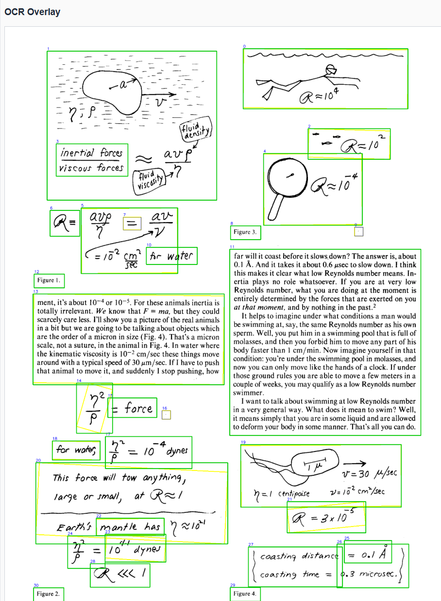

# OSII-Tesseract

OSII-Tesseract is an OCR service built around:

- OpenCV for text-region detection
- Tesseract for OCR
- PyMuPDF for PDF rendering
- FastAPI for the API and demo UI

It supports:

- image OCR through a simple HTTP API
- per-document OCR for PDFs and images
- a demo UI for tuning OpenCV region-detection parameters before running OCR

This is a standalone specialty OCR API, consumed by OSII through its own
adapter rather than the generic Processor API v1. The exact OSII boundary is
bundled in the image at `/app/docs/OSII_INTEGRATION.md`; the endpoint contract
is at `/app/docs/API.md` and the running OpenAPI schema is at `/docs`.

## Highlights

- Detect text regions first, then run OCR
- Region-level deskew using rotated rectangles
- Optional confidence filtering on OCR output
- Configurable Tesseract PSM
- Demo workflow for tuning morphology and contour filtering

## Demo screenshots





## API

### `POST /ocr`

OCR for a single image.

Request:

- content type: `multipart/form-data`
- fields:
  - `file`: image file
  - `language`: optional ISO 639-1 language code, default `en`

Response:

```json
{
  "results": [
    {
      "text": "recognized text",
      "bbox": [10, 20, 60, 40],
      "confidence": 0.95,
      "polygon": [[10, 20], [60, 20], [60, 40], [10, 40]]
    }
  ]
}
```

### `POST /ocr/document`

Per-document OCR for an image or PDF.

Request:

- content type: `multipart/form-data`
- fields:
  - `file`: image or PDF
  - `language`: optional ISO 639-1 language code, default `en`

Response:

```json
{
  "pages": [
    {
      "page": 1,
      "width": 1700,
      "height": 2200,
      "results": [
        {
          "text": "recognized text",
          "bbox": [10, 20, 60, 40],
          "confidence": 0.95,
          "polygon": [[10, 20], [60, 20], [60, 40], [10, 40]]
        }
      ]
    }
  ]
}
```

### `GET /demo`

Interactive demo and tuning UI.

Use it to:

- upload a PDF or image
- select a page
- tune OpenCV preprocessing and contour filters
- inspect intermediate images
- detect regions before OCR
- run OCR on cached region sets
- filter OCR results by confidence

### `GET /health`

Returns `{"status": "ok"}` for host and container readiness checks.

## OCR pipeline

Per page, OSII-Tesseract:

1. loads the image or renders the PDF page
2. converts to grayscale
3. thresholds to suppress scan artifacts and faint stray marks
4. removes small noise with morphology
5. dilates to merge text into larger blobs
6. finds contiguous candidate regions
7. filters small or implausible regions
8. computes rotated rectangles and polygons
9. deskews each region locally
10. runs Tesseract on the deskewed region crop

PDF pages are rendered and recognized sequentially, keeping memory use bounded
for long documents instead of retaining every high-resolution page image.

## Local development

For local Windows development, use Python 3.12.

Example:

```powershell
py -3.12 -m venv .venv312
.venv312\Scripts\Activate.ps1
python -m pip install --upgrade pip
pip install -r requirements.txt
python -m uvicorn app.main:app --host 127.0.0.1 --port 8080
```

Open:

```text
http://127.0.0.1:8080/docs
http://127.0.0.1:8080/demo
```

## Configuration

Environment variables:

- `ENABLE_DEMO`
  - enables the demo UI
- `DEFAULT_PDF_DPI`
  - PDF render DPI
- `DEMO_STORAGE_DIR`
  - temporary storage used by the demo
- `DEMO_MAX_FILE_SIZE_MB`
  - demo upload size limit

## Notes

- `/ocr` is the strict image OCR endpoint.
- `/ocr/document` is the per-document extension endpoint.
- the demo module is optional and intended for parameter exploration and tuning.

## Troubleshooting

### OCR is very slow

This usually means the current OpenCV settings are producing too many candidate regions. Use the demo to tune:

- dilation kernel size
- morphology kernel sizes
- contour filtering thresholds
- max region cap

### Tiny stray marks are being treated as text

Tune:

- opening kernel size
- minimum contour area
- minimum width and height

### PyMuPDF fails to install locally

Use Python 3.12 for local Windows development.
