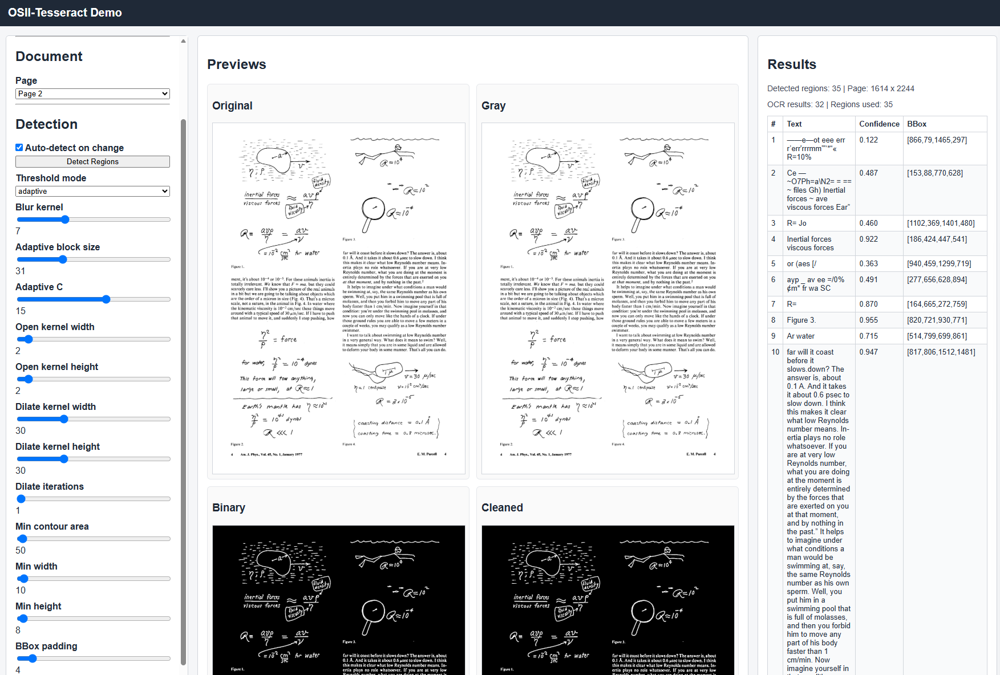

# Experimental Tesseract OCR with OpenCV regions

OSII-Tesseract is an OCR service built around:

- OpenCV for text-region detection
- Tesseract for OCR
- PyMuPDF for PDF rendering
- FastAPI for the API and demo UI

It supports:

- image OCR through a simple HTTP API
- per-document OCR for PDFs and images
- a demo UI for tuning OpenCV region-detection parameters before running OCR

This is an optional, independently deployable OSII extractor for experiments
that need tunable text regions and bounding boxes. The normal baseline uses the
simpler `local.tesseract-page-ocr` full-page processor instead. This service exposes the generic OSII
Processor API v1 at `POST /v1/extract`, returning one OCR text segment per
detected region with normalized page bounding boxes and polygons. Its native
`/ocr/document` API and tuning UI remain available for direct inspection.
Its stable descriptor is `toolbox.tesseract-opencv`; the former
`toolchest.tesseract-opencv` identity remains a registration alias for this
release.

## Highlights

- Detect text regions first, then run OCR
- Region-level deskew using rotated rectangles
- Optional confidence filtering on OCR output
- Configurable Tesseract PSM
- Demo workflow for tuning morphology and contour filtering

## Demo screenshots




## API

### `POST /v1/extract` — OSII Processor API v1

OSII sends a JSON request containing base64 source bytes. The service returns
one `ocr_region` segment per accepted region. Each segment's `source_origin`
contains the page number, normalized `bbox`, normalized `polygon`, confidence,
and original page dimensions. Use `GET /v1/descriptor` to discover the
supported file types and tunable OCR configuration; use `/docs` for the exact
schema.

### `POST /ocr`

OCR for a single image.

Request:

- content type: `multipart/form-data`
- fields:
  - `file`: image file
  - `language`: optional ISO 639-1 language code, default `en`

Response:

```json
{
  "results": [
    {
      "text": "recognized text",
      "bbox": [10, 20, 60, 40],
      "confidence": 0.95,
      "polygon": [[10, 20], [60, 20], [60, 40], [10, 40]]
    }
  ]
}
```

### `POST /ocr/document`

Per-document OCR for an image or PDF.

Request:

- content type: `multipart/form-data`
- fields:
  - `file`: image or PDF
  - `language`: optional ISO 639-1 language code, default `en`

Response:

```json
{
  "pages": [
    {
      "page": 1,
      "width": 1700,
      "height": 2200,
      "results": [
        {
          "text": "recognized text",
          "bbox": [10, 20, 60, 40],
          "confidence": 0.95,
          "polygon": [[10, 20], [60, 20], [60, 40], [10, 40]]
        }
      ]
    }
  ]
}
```

### `GET /demo`

Interactive demo and tuning UI.

Use it to:

- upload a PDF or image
- select a page
- tune OpenCV preprocessing and contour filters
- inspect intermediate images
- detect regions before OCR
- run OCR on cached region sets
- filter OCR results by confidence

### `GET /health`

Returns `{"status": "ok"}` for host and container readiness checks.

## OCR pipeline

Per page, OSII-Tesseract:

1. loads the image or renders the PDF page
2. converts to grayscale
3. thresholds to suppress scan artifacts and faint stray marks
4. removes small noise with morphology
5. dilates to merge text into larger blobs
6. finds contiguous candidate regions
7. filters small or implausible regions
8. computes rotated rectangles and polygons
9. deskews each region locally
10. runs Tesseract on the deskewed region crop

PDF pages are rendered and recognized sequentially, keeping memory use bounded
for long documents instead of retaining every high-resolution page image.

## Local development

Install the native Tesseract executable first and confirm `tesseract --version`
works. From the OSII root, use the same Python 3.12 default as the application
on macOS, Linux, or Windows:

```sh
uv run --no-project --python 3.12 --with-editable osii-core --with-editable osii-toolbox/osii-tesseract python -m uvicorn app.main:app --app-dir osii-toolbox/osii-tesseract --host 127.0.0.1 --port 8081
```

Build the image from the OSII repository root. It includes Tesseract, so the
container path does not need a host installation. Both build and runtime stages
use the shared RHEL/UBI base. Tesseract 5.5.3, Leptonica 1.87.0, and eight
`tessdata_fast` 4.1.0 languages are downloaded as pinned, checksum-verified
build artifacts. See [Quay publishing](../README.md).

```bash
make toolbox-build TOOL=tesseract-opencv
make toolbox-run TOOL=tesseract-opencv
```

Corporate builds can set `OSII_TESSERACT_SOURCE_URL`,
`OSII_LEPTONICA_SOURCE_URL`, and `OSII_TESSDATA_BASE_URL` in the root `.env` to
use byte-identical copies from an approved artifact mirror. Use the explicit
Toolbox commands above; normal `make build` builds the simpler baseline OCR
instead. Do not change checksums to accommodate a repacked or unreviewed artifact.

Open:

```text
http://127.0.0.1:8081/docs
http://127.0.0.1:8081/demo
```

Contract tests (mocked OCR; no model downloads) run from this component directory:

```sh
uv run --no-project --python 3.12 --with-editable ../../osii-core --with-editable . --with pytest python -m pytest tests -q
```

## Configuration

Environment variables:

- `ENABLE_DEMO`
  - enables the demo UI
- `DEFAULT_PDF_DPI`
  - PDF render DPI
- `DEMO_STORAGE_DIR`
  - temporary storage used by the demo
- `DEMO_MAX_FILE_SIZE_MB`
  - demo upload size limit

## Notes

- `/ocr` is the strict image OCR endpoint.
- `/ocr/document` is the per-document extension endpoint.
- the demo module is optional and intended for parameter exploration and tuning.

## Troubleshooting

### OCR is very slow

This usually means the current OpenCV settings are producing too many candidate regions. Use the demo to tune:

- dilation kernel size
- morphology kernel sizes
- contour filtering thresholds
- max region cap

### Tiny stray marks are being treated as text

Tune:

- opening kernel size
- minimum contour area
- minimum width and height

### PyMuPDF fails to install locally

Use Python 3.12 for local Windows development.
